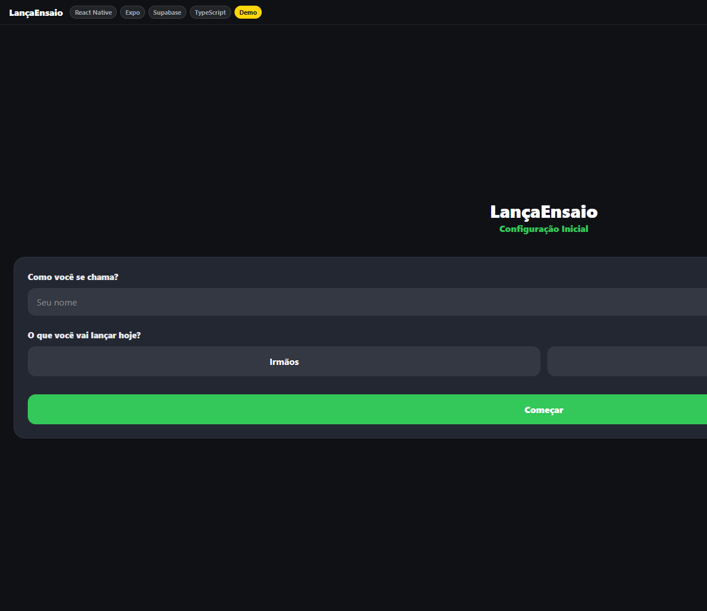
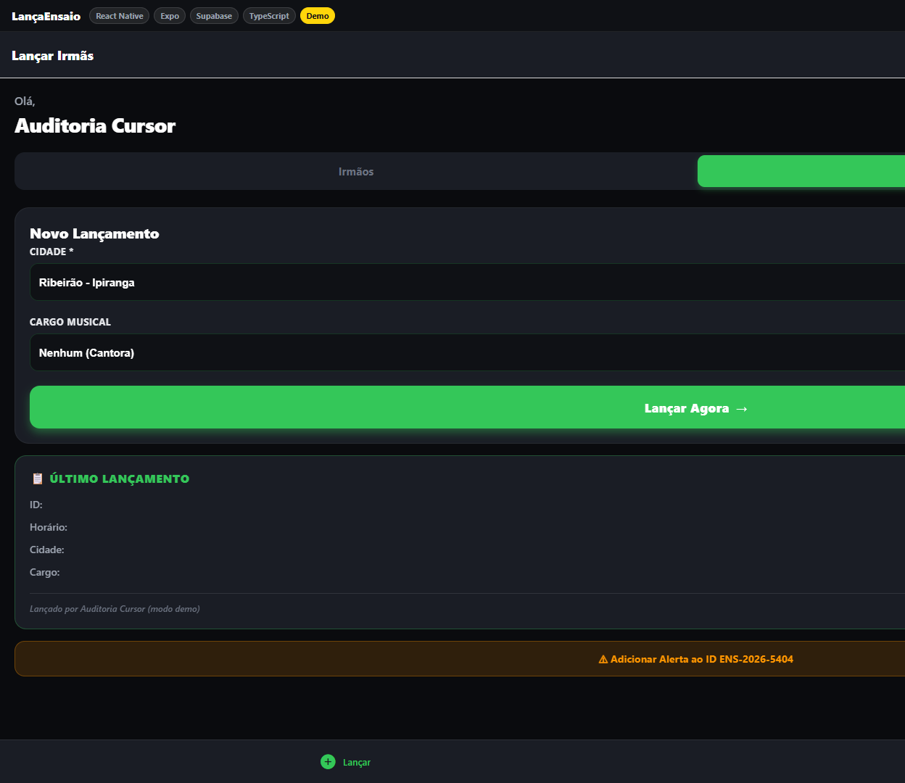

<div align="center">
  

  <h1>LançaEnsaio</h1>
  <p><strong>Registro rápido e auditável de ensaios de orquestra — do celular à planilha, sem planilha aberta na mão.</strong></p>

  <p>
    
    
    
    
    
    
  </p>

  <p>
    <a href="https://lancaensaio.vercel.app"><strong>🌐 Web Demo</strong></a> ·
    <a href="https://github.com/BarujaFe1/LancaEnsaio/releases/latest"><strong>⬇️ APK</strong></a> ·
    <a href="https://barujafe.vercel.app/"><strong>Portfólio</strong></a> ·
    <a href="./docs/ARCHITECTURE.md"><strong>Arquitetura</strong></a>
  </p>
</div>

---

## Screenshots

| Setup | Lançamento | Comprovante | Web demo |
|-------|------------|-------------|----------|
|  |  |  |  |

Demo ao vivo: **https://lancaensaio.vercel.app**  
> A demo pública pode estar em build anterior até o redeploy Vercel desta branch. O código-fonte desta branch é a fonte de verdade.

Case study: [`docs/CASE_STUDY.md`](./docs/CASE_STUDY.md) · Roteiro 3–5 min: [`docs/DEMO_SCRIPT.md`](./docs/DEMO_SCRIPT.md)

---

## Problema real

Em ensaios regionais, o registro de presença/função costuma viver em papel ou planilha editada no celular. Isso gera:

- preenchimento inconsistente (cidade, categoria, instrumento, cargo);
- pouca rastreabilidade de quem lançou;
- correções manuais sem histórico;
- atrito alto no momento do ensaio.

## Solução

App mobile (Expo) com fluxo guiado de **menos de um minuto**: identificar o lançador, escolher modo Irmãos/Irmãs, preencher campos contextuais e gravar com **ID + auditoria automática** em Google Sheets via Supabase Edge Function. Correções posteriores viram **alerta** anexado ao mesmo registro.

---

## Principais funcionalidades

- Setup inicial (nome + modo) com persistência local
- Fluxos distintos **Irmãos** / **Irmãs**
- Catálogo dinâmico (cidades, instrumentos, ministérios, cargos) via API
- Regras de auditoria (Cantor/Cantora padrão, erros 01–05/11) **com testes**
- Comprovante do último lançamento + alerta de correção
- **Auth por app token** na Edge Function (Bearer / `x-app-token`)
- **Fila offline** com `Idempotency-Key` (sem duplicar linha no retry)
- Trava de cidade + draft local do formulário
- Banner de demo / offline / pendências de sync
- Web demo sem backend (modo mock) para recrutadores

---

## Arquitetura

```text
App Expo (Android/Web)
    │  Bearer app token + Idempotency-Key
    │  (ou demo local / fila offline)
    ▼
Supabase Edge Function `api`
    │  auth → auditoria → Sheets API (service account)
    ▼
Google Sheets (Base Geral / Dados Geral)
```

Detalhes: [`docs/ARCHITECTURE.md`](./docs/ARCHITECTURE.md)

---

## Stack

| Camada | Tecnologia |
|--------|------------|
| Mobile / Web | Expo 54, React Native, Expo Router, TypeScript |
| HTTP | Axios |
| Local | AsyncStorage, NetInfo |
| Backend | Supabase Edge Functions (Deno) |
| Dados | Google Sheets API v4 |
| Qualidade | ESLint, `tsc`, Jest, GitHub Actions |
| Deploy | EAS (APK), Vercel (web demo) |

---

## Demo local

### Web demo (sem secrets)

```bash
git clone https://github.com/BarujaFe1/LancaEnsaio.git
cd LancaEnsaio/mobile
npm ci
npm run web
```

Sem `EXPO_PUBLIC_API_URL`, o app entra em **modo demonstração**.

### App com API real

```bash
cd mobile
cp .env.example .env
# edite EXPO_PUBLIC_API_URL
npm ci
npm start
```

### Comandos úteis

```bash
npm run lint
npm run typecheck
npm test
npm run ci
npm run export:web
```

---

## Variáveis de ambiente

Ver `mobile/.env.example` e [`docs/DEPLOYMENT.md`](./docs/DEPLOYMENT.md).

| Variável | Onde | Uso |
|----------|------|-----|
| `EXPO_PUBLIC_API_URL` | App / EAS | Base da Edge Function |
| `EXPO_PUBLIC_APP_API_TOKEN` | App / EAS | Mesmo valor de `APP_API_TOKEN` |
| `EXPO_PUBLIC_DEMO` | App (opcional) | Força modo demo |
| `APP_API_TOKEN` | Supabase secret | Auth da API |
| `ORQUESTRA_SHEET_ID` | Supabase secret | Planilha |
| `GOOGLE_SERVICE_ACCOUNT_B64` | Supabase secret | Credencial Sheets |

---

## Testes

```bash
cd mobile && npm test
```

Cobertura atual: auditoria, form-state, auth/idempotência/fila (**25 testes**).  
Guia: [`docs/TESTING.md`](./docs/TESTING.md)

---

## Decisões técnicas e trade-offs

Resumo em [`docs/TECHNICAL_DECISIONS.md`](./docs/TECHNICAL_DECISIONS.md):

- Sheets como sistema operacional (familiaridade > modelo relacional)
- Identificação por nome + **token de app** (baixa fricção; não é login JWT)
- Demo mode automático para portfólio web
- Domínio de auditoria testável no cliente e no servidor
- Fila offline com idempotência em vez de bloquear o lançamento

**Trade-off consciente:** o token de app vai no bundle (`EXPO_PUBLIC_*`). Mitiga abuso casual da URL; não substitui auth de usuário. Ver [`SECURITY_NOTES.md`](./SECURITY_NOTES.md).

---

## Roadmap

- [x] Auth por app token na Edge Function
- [x] Fila offline com idempotência
- [x] Screenshots no README
- [ ] Unificar módulo de auditoria mobile ↔ Deno (pacote shared)
- [ ] JWT / login de usuário + rate limit
- [ ] Observabilidade (logs estruturados / alertas de falha Sheets)
- [ ] Vídeo MP4 publicado (roteiro pronto)

## Status atual

**APK operacional + demo web pública + quality/security pass nesta branch.**  
Claims seguros: automação operacional mobile, integração Edge Function → Sheets, regras testáveis, fila offline, CI.  
Evitar: “enterprise”, “IA”, “segurança à prova de invasão”, “produção 24/7 com SLAs”.

---

## O que este projeto demonstra

- Produto mobile usado em contexto real (não só tutorial)
- Integração serverless (Supabase) + Google APIs
- Modelagem de regras de negócio testáveis
- UX para operação em campo (fluxo curto, comprovante, alerta)
- Capacidade de empacotar o mesmo app como demo web de portfólio
- Disciplina de engenharia: CI, typecheck, security notes, handoff

---

## Como eu apresentaria em entrevista

1. **Contexto:** “Substitui lançamento manual inconsistente em ensaio regional.”  
2. **Fluxo:** setup → lançar → ID + auditoria na planilha.  
3. **Decisão dura:** Sheets como sink; Edge Function como gate de regras + token.  
4. **Qualidade:** mostro testes de auditoria/idempotência e o CI.  
5. **Offline:** enfileira com `Idempotency-Key` e sincroniza sem duplicar.  
6. **Honestidade:** token no cliente; próximo passo seria JWT de usuário.  
7. **Demo:** https://lancaensaio.vercel.app + [`docs/DEMO_SCRIPT.md`](./docs/DEMO_SCRIPT.md).

---

## Documentação

- [`docs/PORTFOLIO_HANDOFF.md`](./docs/PORTFOLIO_HANDOFF.md)
- [`docs/CASE_STUDY.md`](./docs/CASE_STUDY.md)
- [`docs/AUDIT_REPORT.md`](./docs/AUDIT_REPORT.md)
- [`docs/HANDOFF.md`](./docs/HANDOFF.md)
- [`docs/DEPLOYMENT.md`](./docs/DEPLOYMENT.md)
- [`CHANGELOG.md`](./CHANGELOG.md)
- [`COMECE_AQUI.md`](./COMECE_AQUI.md) · [`COMO_GERAR_APK.md`](./COMO_GERAR_APK.md)

---

## Autor

**Felipe Alirio Baruja** · [Portfólio](https://barujafe.vercel.app/) · [GitHub](https://github.com/BarujaFe1)
